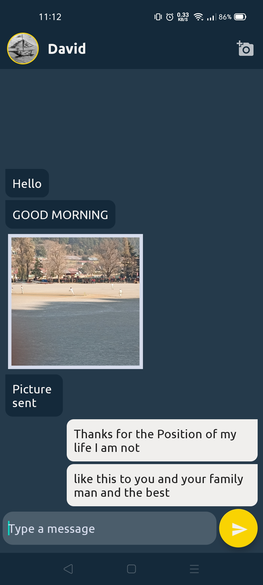

# Description 

- Application Name - **Encrpyto**
- Architecture Used - MVVM
- Language Used - Kotlin (v1.4.32), JAVA
- IDE used - Android Studio (v4.1.2)  
- Database used - FIrebase, ROOM

# About
 - This is and secured messenger application written in Java and Kotlin
 - End To End encryption of messages 
 - Storing hashed passwords of users
 - Store *Favourites* of current user in ROOM database
 - Includes Push Notifications

# Topics

- ROOM database
- Kotlin Coroutines
- MVVM architecture
- Retrofit
- Firebase Database
- Firbase Cloud Messeging
- Material Design
- LiveData
- ViewModel

# Algorithms Used 

- **SHA 256**
- **AES**

# Screenshots

 | LOGIN | SIGN UP | RECENTS |
 --------------|------------|-------------|
 |  |   |  |
 
 | USERS | CHAT | FAVOURITES |
 --------------|------------|-------------|
 |  |   |  |

